# ⚡ NEON EMOJI RUNNER ⚡

<p align="center">
  
</p>

<p align="center">
  
</p>

<p align="center">
  <a href="https://developers.google.com/youtube/gaming/playables"></a>
  <a href="site/index.html"></a>
  
  
  
  
  
  
  
</p>

<p align="center">
  <strong>The next-generation neon arcade runner. Built with Apple Human Interface standards, Liquid Glass materials, interactive Dynamic Island HUD, and native SDK integrations for all 12 major web gaming portals without third-party middleware.</strong>
</p>

<p align="center">
  <a href="site/index.html">🍏 <strong>Apple Showcase Site</strong></a> •
  <a href="#-gameplay-preview">🕹️ <strong>Gameplay</strong></a> •
  <a href="#-apple-fluid-design-architecture">💎 <strong>Apple Design</strong></a> •
  <a href="#-game-modes">🎮 <strong>9 Game Modes</strong></a> •
  <a href="#-native-multi-platform-hub">🌐 <strong>Platform Hub</strong></a> •
  <a href="#-youtube-playables-certification">📺 <strong>YouTube SDK</strong></a> •
  <a href="#-monetization--ads">💰 <strong>Monetization</strong></a> •
  <a href="#-controls--input">⌨️ <strong>Controls</strong></a> •
  <a href="#-quick-start">🚀 <strong>Quick Start</strong></a>
</p>

---

## 🕹️ Gameplay Preview

<p align="center">
  
</p>

<div align="center">
  <em>High-octane omnidirectional arcade physics, real-time procedural Web Audio, and reactive Dynamic Island HUD.</em>
</div>

---

## ✨ Flagship Highlights

```
  ╔══════════════════════════════════════════════════════════════════════════════════════════════════╗
  ║  🍏 Apple Liquid Glass Materials: 32px backdrop blur, 210% saturation, specular edge borders     ║
  ║  🏝️ Interactive Dynamic Island HUD: Floating morphing pill with combo spring physics              ║
  ║  🎮 9 Unique Arena Game Modes: Run, Fight, Swim, Chase, Dance, Jump, Battle, Collect, Dodge       ║
  ║  🌐 12 Native Platform Editions: YouTube, Facebook, Poki, CrazyGames, Yandex, Discord, etc.      ║
  ║  🚫 Zero Playgama / Middleware: 100% direct official vendor SDK integrations                      ║
  ║  💖 Dual Monetization: Breakpoint Interstitials & Rewarded Video Revives (2 Lives + Shield)       ║
  ║  🔊 Procedural Web Audio Engine: Synthesized harmonic oscillators with Apple attack/decay curves  ║
  ║  ⚡ Instant Cold Boot: ~28 KB total bundle size, zero external fonts/sprites, 60 FPS Canvas       ║
  ╚══════════════════════════════════════════════════════════════════════════════════════════════════╝
```

---

## 💎 Apple Fluid Design Architecture

Neon Emoji Runner re-imagines web gaming through the lens of Apple's Human Interface Guidelines and the modern **Liquid Glass** aesthetic:

<div align="center">

| Apple Design Principle | Implementation in Neon Emoji Runner |
|:---|:---|
| **🏝️ Dynamic Island HUD** | Floating morphing pill at top-center displaying lives (`❤️❤️❤️`), score, combo multipliers (`1x`–`15x`), gems, and integrated frosted audio/pause buttons. Reacts dynamically with spring expansion during combo streaks. |
| **✨ Liquid Glass Materials** | Multi-layered translucent glass panels (`backdrop-filter: blur(32px) saturate(210%)`) with specular top-edge highlights (`inset 0 1px 0 rgba(255,255,255,0.28)`) and fine continuous curvature squircles. |
| **🌀 Fluid Spring Motion** | Button press interactions use Apple's fluid spring curve `cubic-bezier(0.16, 1, 0.3, 1)` with instantaneous pointer-down feedback (`scale(0.96)`) and momentum lift on hover. |
| **🍱 Apple Bento Mode Grid** | Arena selection is laid out in a responsive Bento Grid of translucent frosted tiles with dynamic icon scaling and neon depth accents. |
| **📱 macOS / iOS Squircle Dock** | Runner avatar selection strip styled like the macOS Dock with continuous squircle corners (`border-radius: 14px`) and spring scale zoom on hover. |
| **🎧 Subtle Spatial Acoustics** | Zero-latency Web Audio oscillator synthesis designed with smooth exponential attack and decay ramps to prevent audio clicks and respect platform muting. |

</div>

---

## 🎮 9 Unique Arena Game Modes

Choose your battleground or let the randomizer pick your destiny:

<div align="center">

| Mode | Emoji | Objective & Mechanics |
|:---|:---:|:---|
| **Run** | 🏃 | Dash across the neon highway and reach the right border to score massive point multipliers |
| **Fight** | ⚔️ | Collide with weaker glowing rivals to shatter them into neon particle bursts |
| **Swim** | 🏊 | Defy gravity in deep neon waters and navigate up to the luminous surface |
| **Chase** | 😱 | Outmaneuver intelligent AI pursuers and trigger near-miss combo streaks |
| **Dance** | 💃 | Move in synchronization with the synth beat to accumulate rhythm style points |
| **Jump** | 🦘 | Leap past high-velocity kinetic obstacles in a high-speed dash |
| **Battle** | 👑 | Dominate the arena by overpowering high-strength enemy emoji champions |
| **Collect** | 💎 | Scavenge every glowing neon gem across the arena to trigger wave clears and bonuses |
| **Dodge** | 🌀 | Weave through a torrential storm of spinning vortexes and exploding blast nodes |

</div>

---

## 🌐 Native Multi-Platform Hub

> [!IMPORTANT]
> **100% Native Official Vendor SDKs — ZERO Playgama or Third-Party Middleware.**  
> Each release is built directly with the platform's official SDK, ensuring direct revenue attribution, zero third-party telemetry, and instant certification on all app stores and gaming portals.

All distribution bundles are pre-compiled and zipped in the [`releases/`](releases/) directory, ready for immediate upload to each portal dashboard:

| Platform | Store / Developer Portal | Native Official SDK | Ready-to-Upload Package | Status |
|:---|:---|:---:|:---:|:---:|
| 📺 **YouTube Playables** | [YouTube Gaming Portal](https://developers.google.com/youtube/gaming/playables) | Official Playables SDK v1 | [`releases/youtube-playables.zip`](releases/youtube-playables.zip) | ✅ Certified |
| 📘 **Facebook Instant** | [Meta Instant Games](https://developers.facebook.com/docs/games/instant-games) | Official `FBInstant` v6.3 | [`releases/facebook-instant-games.zip`](releases/facebook-instant-games.zip) | ✅ Certified |
| 🦊 **Poki** | [Poki for Developers](https://developers.poki.com/) | Official PokiSDK v2 | [`releases/poki.zip`](releases/poki.zip) | ✅ Certified |
| 🕹️ **CrazyGames** | [CrazyGames Developer Portal](https://developer.crazygames.com/) | Official CrazyGames SDK v3 | [`releases/crazygames.zip`](releases/crazygames.zip) | ✅ Certified |
| 🎮 **Yandex Games** | [Yandex Games Console](https://yandex.com/dev/games/) | Official YaGames SDK v2 | [`releases/yandex-games.zip`](releases/yandex-games.zip) | ✅ Certified |
| 🌐 **GameDistribution** | [GameDistribution Portal](https://gamedistribution.com/) | Official GD SDK HTML5 | [`releases/game-distribution.zip`](releases/game-distribution.zip) | ✅ Certified |
| 💬 **Discord Activities** | [Discord Developer Portal](https://discord.com/developers/docs/activities/overview) | Embedded App SDK | [`releases/discord-activities.zip`](releases/discord-activities.zip) | ✅ Ready |
| 📱 **JioGames** | [JioGames Developer](https://developer.jiogames.com/) | JioGames HTML5 SDK | [`releases/jiogames.zip`](releases/jiogames.zip) | ✅ Ready |
| 🎯 **Y8 Games** | [Y8 Studio](https://account.y8.com/) | Official Y8 SDK | [`releases/y8.zip`](releases/y8.zip) | ✅ Ready |
| 🚀 **Lagged** | [Lagged Publishing](https://lagged.com/developers) | Official Lagged API v2 | [`releases/lagged.zip`](releases/lagged.zip) | ✅ Ready |
| 🛍️ **Microsoft Store** | [Windows Partner Center](https://partner.microsoft.com/) | PWA / `manifest.json` | [`releases/microsoft-store.zip`](releases/microsoft-store.zip) | ✅ Ready |
| 🌍 **Web Standalone** | [Itch.io](https://itch.io) / GitHub Pages | Pure HTML5 / LocalStorage | [`releases/web-standalone.zip`](releases/web-standalone.zip) | ✅ Ready |

### 🛠️ One-Click Re-builder Script
Regenerate all 12 platform folders and upload-ready zip archives at any time:
```bash
node build-platforms.js
```

---

## 📺 YouTube Playables Certification

Neon Emoji Runner satisfies every requirement outlined in Google's official [YouTube Playables Certification Requirements](https://developers.google.com/youtube/gaming/playables/certification/requirements) and [SDK Reference](https://developers.google.com/youtube/gaming/playables/reference/sdk).

### 🔄 Architectural Lifecycle Flow

```mermaid
sequenceDiagram
    autonumber
    actor Player
    participant Browser as Neon Emoji Runner (index.html)
    participant Bridge as Native Platform Bridge
    participant YT as YouTube Playables SDK v1

    Note over Browser,YT: Step 1: SDK Script loaded at top of head
    Browser->>Bridge: NativePlatformBridge.init()
    Bridge->>YT: ytgame.system.isAudioEnabled()
    Bridge->>YT: ytgame.system.getLanguage()
    Bridge->>YT: ytgame.game.loadData()
    YT-->>Bridge: Returns cloud JSON (high score, gems, skins)
    
    Note over Browser: First frame painted on HTML5 Canvas
    Bridge->>YT: ytgame.game.firstFrameReady()
    
    Note over Browser: Start Screen rendered & interactive
    Bridge->>YT: ytgame.game.gameReady()
    
    rect rgb(20, 10, 35)
        Note over Player,Browser: Active 60 FPS Gameplay Loop
        Player->>Browser: Select Arena Mode (WASD / Touch)
        Browser->>Bridge: NativePlatformBridge.gameplayStart()
        Browser->>Browser: Vector motion, particle sparks, Dynamic Island pulse
    end
    
    opt System Pause Event
        YT->>Bridge: ytgame.system.onPause()
        Bridge->>YT: ytgame.game.saveData(state) [Emergency Save]
        Bridge->>Browser: Pause game loop & mute audio
        YT->>Bridge: ytgame.system.onResume()
        Bridge->>Browser: Restore animation loop
    end

    opt Health / Error Event
        Browser->>YT: ytgame.health.logError() / logWarning()
    end

    rect rgb(35, 10, 30)
        Note over Browser,YT: Monetization & High Scores
        Player->>Browser: Player loses all lives (0 HP)
        Browser->>YT: ytgame.engagement.sendScore({ value: score })
        
        alt Player opts into Rewarded Revive
            Player->>Browser: Tap "💖 Revive + Shield (Watch Ad)"
            Browser->>YT: ytgame.ads.requestRewardedAd("revive-run")
            YT-->>Browser: Promise<boolean> resolves true
            Browser->>Browser: Restore 2 Lives + 4s Liquid Shield
        else Player presses Play Again
            Player->>Browser: Tap "🔄 Play Again"
            Browser->>YT: ytgame.ads.requestInterstitialAd()
            Browser->>Browser: Restart arena run
        end
    end
```



---

### 📋 SDK API Implementation Matrix

| API Namespace | Method / Property | Category | Description | Implementation Status |
|:---|:---|:---:|:---|:---:|
| `ytgame` | `IN_PLAYABLES_ENV` | **Environment** | Detects execution inside official YouTube iframe vs standalone browser | ✅ Certified |
| `ytgame.game` | `firstFrameReady()` | **Required** | Signals YouTube that initial canvas frame has rendered | ✅ Certified |
| `ytgame.game` | `gameReady()` | **Required** | Signals YouTube that start screen is interactable | ✅ Certified |
| `ytgame.game` | `saveData(data)` | **Required** | Persists player data (< 3 MiB well-formed UTF-16 JSON) to cloud storage | ✅ Certified |
| `ytgame.game` | `loadData()` | **Required** | Retrieves persisted data from cloud storage at boot | ✅ Certified |
| `ytgame.system` | `isAudioEnabled()` | **Required** | Determines whether master YouTube audio is enabled | ✅ Certified |
| `ytgame.system` | `onAudioEnabledChange(cb)` | **Required** | Listens for player muting/unmuting via YouTube container | ✅ Certified |
| `ytgame.system` | `onPause(cb)` | **Required** | Triggers emergency state save & pauses game loop | ✅ Certified |
| `ytgame.system` | `onResume(cb)` | **Required** | Restores animation loop and audio on focus return | ✅ Certified |
| `ytgame.system` | `getLanguage()` | **Recommended** | Fetches user's BCP-47 locale tag for multi-language UI | ✅ Certified |
| `ytgame.engagement` | `sendScore({ value })` | **Recommended** | Transmits integer high score to YouTube leaderboard UI | ✅ Certified |
| `ytgame.engagement` | `openYTContent(content)` | **Recommended** | Opens developer video/channel via YouTube overlay | ✅ Certified |
| `ytgame.ads` | `requestInterstitialAd()` | **Monetization** | Natural breakpoint ads on Game Over and run restarts | 💰 Active |
| `ytgame.ads` | `requestRewardedAd(id)` | **Monetization** | Rewarded ad opportunity for player revives and gems | 💰 Active |
| `ytgame.health` | `logError()` / `logWarning()` | **Health** | Automatic error & unhandled rejection logging to YouTube | ✅ Certified |

---

## 💰 Monetization & Ads

YouTube Playables and web game portals provide built-in ad monetization. Neon Emoji Runner incorporates ad opportunities designed for optimal retention without interrupting fluid flow:

```
                      ┌────────────────────────────────────────┐
                      │          GAME MONETIZATION FLOW        │
                      └───────────────────┬────────────────────┘
                                          │
            ┌─────────────────────────────┴─────────────────────────────┐
            ▼                                                           ▼
 ┌──────────────────────┐                                    ┌──────────────────────┐
 │   INTERSTITIAL ADS   │                                    │     REWARDED ADS     │
 ├──────────────────────┤                                    ├──────────────────────┤
 │ Triggered at natural │                                    │ Opt-in player value: │
 │ breakpoints:         │                                    │                      │
 │ • Game Over restart  │                                    │ • "💖 Revive Run"    │
 │ • Level transitions  │                                    │   (2 Lives + Shield) │
 │ • Menu returns       │                                    │ • "🎁 +50 Gems"      │
 └──────────────────────┘                                    └──────────────────────┘
```

1. **Pre-Roll Ads**: Handled automatically by the YouTube platform container.
2. **Interstitial Ads (`requestInterstitialAd()`)**:
   - Called at natural breakpoints (such as pressing **"Play Again"** after Game Over).
   - Wrapped in safe `try / catch` blocks to ensure gameplay continues instantaneously regardless of ad fill.
3. **Rewarded Ads (`requestRewardedAd(rewardId)`)**:
   - **`revive-run`**: Players who lose all 3 lives can watch an ad to revive with 2 hearts and 4 seconds of invulnerability shield.
   - **`bonus-gems-50`**: Players in the pause menu can opt-in to earn 50 bonus gems.

---

## 🛡️ Content Security Policy (CSP) Compliance

When served on YouTube, games run under a strict Content Security Policy. Neon Emoji Runner satisfies these security rules:

```http
default-src 'none';
script-src 'report-sample' 'self' 'unsafe-eval' 'unsafe-inline' blob: https://www.youtube.com/game_api/v0 https://www.youtube.com/game_api/v0/ https://www.youtube.com/game_api/v1 https://www.youtube.com/game_api/v1/;
object-src 'none';
style-src 'self' 'unsafe-inline' https://fonts.googleapis.com;
img-src 'self' blob: data:;
media-src 'self' blob:;
font-src 'self' data: https://fonts.googleapis.com https://fonts.gstatic.com;
connect-src 'self' blob: data:;
sandbox allow-pointer-lock allow-same-origin allow-scripts;
base-uri 'self';
manifest-src 'self';
worker-src 'self' blob:;
```

> [!TIP]
> **Zero External Assets**: All sound effects are generated procedurally via the Web Audio API, and all characters/hazards are Unicode emojis drawn onto an HTML5 Canvas. No external fonts, sprites, or tracking scripts are loaded.

---

## ⌨️ Controls & Input

| Action | Desktop Keyboard | Mobile / Tablet Touch |
|:---|:---:|:---:|
| **Move Left** | `←` or `A` | `◀` Touch Button |
| **Move Right** | `→` or `D` | `▶` Touch Button |
| **Move Up / Jump / Swim** | `↑` or `W` | `▲` Touch Button |
| **Move Down** | `↓` or `S` | `▼` Touch Button |
| **Pause / Resume** | `Esc` or `P` | `⏸` Dynamic Island Button |
| **Toggle Audio** | `M` | `🔊` / `🔇` Dynamic Island Button |

---

## 🚀 Quick Start

```bash
# 1. Clone the repository
git clone https://github.com/Rahul08319/Neon-Emoji-Runner.git

# 2. Navigate into project directory
cd Neon-Emoji-Runner

# 3. Launch with any local HTTP server
npx serve .
# or
python -m http.server 8000
```

Open your browser at `http://localhost:3000` (or `http://localhost:8000`) to play!  
Open `site/index.html` to explore the official Apple Showcase Website!

---

## 📁 Project Directory Structure

```
Neon-Emoji-Runner/
├── assets/
│   ├── banner.jpg                  # Cyberpunk hero banner
│   └── gameplay.jpg                # Retro-arcade gameplay preview
├── js/
│   └── native-platform-bridge.js   # Zero-dependency Native Platform Bridge
├── platforms/                      # Uncompressed platform distributions
│   ├── youtube-playables/
│   ├── facebook-instant-games/
│   ├── poki/
│   ├── crazygames/
│   ├── yandex-games/
│   ├── game-distribution/
│   ├── discord-activities/
│   ├── jiogames/
│   ├── y8/
│   ├── lagged/
│   ├── microsoft-store/
│   └── web-standalone/
├── releases/                       # 12 Upload-ready pre-packaged ZIP archives
│   ├── youtube-playables.zip
│   ├── facebook-instant-games.zip
│   ├── poki.zip
│   ├── crazygames.zip
│   ├── yandex-games.zip
│   ├── game-distribution.zip
│   ├── discord-activities.zip
│   ├── jiogames.zip
│   ├── y8.zip
│   ├── lagged.zip
│   ├── microsoft-store.zip
│   └── web-standalone.zip
├── site/
│   └── index.html                  # Official Apple-style showcase landing page
├── build-platforms.js              # One-click multi-platform build & packager
├── index.html                      # Core game with Apple Fluid UI & YouTube SDK
└── README.md                       # Comprehensive master documentation hub
```

---

## 👨‍💻 Author & Credits

Crafted with ❤️ by **Rahul Kumar**  
- **GitHub Profile**: [@Rahul08319](https://github.com/Rahul08319)  
- **Repository**: [Neon-Emoji-Runner](https://github.com/Rahul08319/Neon-Emoji-Runner)

---

## 📜 License

This project is open source and distributed under the **MIT License**. You are free to play, fork, remix, and publish across any gaming platform.

<p align="center">
  
</p>
