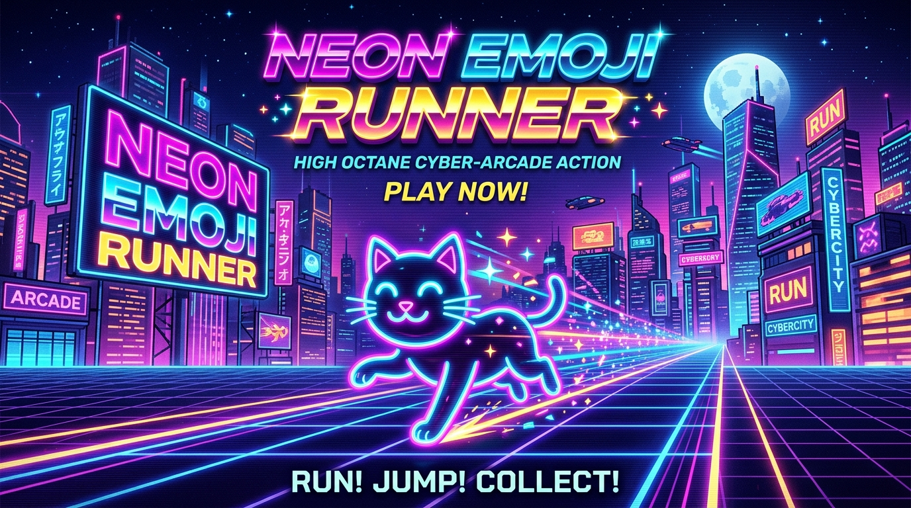
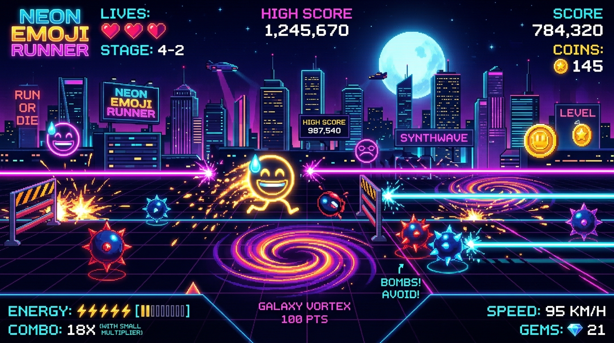

# ⚡ NEON EMOJI RUNNER ⚡

<p align="center">
  
</p>

<p align="center">
  <a href="https://developers.google.com/youtube/gaming/playables"></a>
  <a href="https://developers.google.com/youtube/gaming/playables/reference/sdk"></a>
  
  
  
  
  
  
</p>

<p align="center">
  <strong>An ultra-fast, neon-soaked cyberpunk arcade runner engineered for the web and fully certified for Google YouTube Playables with native Monetization, Cloud Persistence, and Dynamic Audio.</strong>
</p>

<p align="center">
  <a href="#-features">✨ Features</a> •
  <a href="#-game-modes">🎮 Game Modes</a> •
  <a href="#-gameplay-preview">🕹️ Gameplay Preview</a> •
  <a href="#-youtube-playables-sdk-integration">📺 YouTube SDK</a> •
  <a href="#-monetization--ads">💰 Monetization</a> •
  <a href="#-controls--input">⌨️ Controls</a> •
  <a href="#-certification--testing">🧪 Test Suite</a> •
  <a href="#-quick-start">🚀 Run Locally</a>
</p>

---

## 🕹️ Gameplay Preview

<p align="center">
  
</p>

---

## ✨ Features

```
  ╔═══════════════════════════════════════════════════════════════════════════════╗
  ║  ⚡ 100% YouTube Playables SDK Compliance (Lifecycle, Cloud Save, Ads, Audio)  ║
  ║  ⚡ Procedural Web Audio Synthesizer (Zero asset latency, respects mute)       ║
  ║  ⚡ Rewarded Ad Integration (Revive with Neon Shield + Bonus Gems)            ║
  ║  ⚡ Natural Breakpoint Interstitial Ads (Between runs & on game over)        ║
  ║  ⚡ Multi-Locale Localization (English, Español, 日本語, हिन्दी, Français, etc) ║
  ║  ⚡ 3-Heart Health System with Invulnerability Shields & Particle Physics    ║
  ║  ⚡ Single File Architecture (~28 KB total payload, instantaneous load)       ║
  ╚═══════════════════════════════════════════════════════════════════════════════╝
```

| Dimension | Specification |
|:---|:---|
| **Visual Engine** | Pure HTML5 Canvas 2D with dynamic radial lighting, synthwave perspective grids, neon particle explosions, motion trails, and camera shake |
| **Physics & Controls** | Precision omnidirectional vector movement with momentum dampening, wall clamping, keyboard (WASD / Arrows) + mobile multi-touch D-Pad |
| **Game Modes** | **9 Unique Arenas**: `RUN`, `FIGHT`, `SWIM`, `CHASE`, `DANCE`, `JUMP`, `BATTLE`, `COLLECT`, and `DODGE` |
| **Health & Progression** | 3-Heart lives system (`❤️❤️❤️`), temporary invincibility shields, combo multipliers, speed scaling, and level milestones |
| **Cloud Persistence** | UTF-16 validated JSON cloud sync through `ytgame.game.saveData()` / `loadData()` with robust `localStorage` fallback |
| **Audio Engine** | Procedural Web Audio API oscillator synthesis dynamically bound to `ytgame.system.isAudioEnabled()` and `onAudioEnabledChange()` |
| **Monetization** | Seamless interstitial ads on level restarts and rewarded video ads for player revives and bonus gem unlocks |

---

## 🎮 Game Modes

Choose your battleground or let the randomizer pick your destiny:

<div align="center">

| Mode | Emoji | Objective & Mechanics |
|:---|:---:|:---|
| **Run** | 🏃 | Dash across the neon highway and reach the right border to score massive bonuses |
| **Fight** | ⚔️ | Collide with weaker glowing rivals to shatter them into neon sparks |
| **Swim** | 🏊 | Defy gravity in deep neon waters and navigate up to the surface |
| **Chase** | 😱 | Outrun smart AI pursuers and trigger near-miss combo streaks |
| **Dance** | 💃 | Move in synchronization with the synth beat to accumulate rhythm points |
| **Jump** | 🦘 | Leap past high-velocity kinetic obstacles in a high-speed obstacle dash |
| **Battle** | 👑 | Dominate the arena by overpowering high-strength enemy emoji champions |
| **Collect** | 💎 | Scavenge every glowing neon gem across the arena to trigger wave clears |
| **Dodge** | 🌀 | Weave through a torrential storm of spinning vortexes and exploding blast nodes |

</div>

---

## 📺 YouTube Playables SDK Integration

This game strictly satisfies all requirements outlined in the official [YouTube Playables Certification Requirements](https://developers.google.com/youtube/gaming/playables/certification/requirements) and [SDK Reference](https://developers.google.com/youtube/gaming/playables/reference/sdk).

### 🔄 Architectural Lifecycle Flow

```mermaid
sequenceDiagram
    autonumber
    actor Player
    participant Browser as Game (index.html)
    participant SDK as ytgame SDK v1
    participant YT as YouTube Platform

    Note over Browser,SDK: Step 1: SDK Script loaded first in <head>
    Browser->>SDK: Initialize system event listeners & error hooks
    Browser->>SDK: ytgame.system.isAudioEnabled()
    Browser->>SDK: ytgame.system.getLanguage()
    Browser->>SDK: ytgame.game.loadData()
    SDK-->>Browser: Return cloud save data (high score, gems, skins)
    
    Note over Browser: First paint rendered on canvas
    Browser->>SDK: ytgame.game.firstFrameReady()
    
    Note over Browser: Start Screen rendered & interactive
    Browser->>SDK: ytgame.game.gameReady()
    
    rect rgb(20, 0, 40)
        Note over Player,Browser: Active Gameplay Loop
        Player->>Browser: Select Mode & Play (WASD / Touch)
        Browser->>Browser: Update physics, combos, particle bursts
    end
    
    opt System Pause Event
        YT->>SDK: System pause / tab unfocused
        SDK->>Browser: ytgame.system.onPause() callback
        Browser->>SDK: ytgame.game.saveData(state) [Emergency Save]
        Browser->>Browser: Pause game loop & mute audio
        YT->>SDK: System resume
        SDK->>Browser: ytgame.system.onResume() callback
        Browser->>Browser: Resume game loop
    end

    opt Health / Error Event
        Browser->>SDK: ytgame.health.logError() / logWarning()
    end

    rect rgb(35, 0, 30)
        Note over Browser,YT: Monetization & High Scores
        Player->>Browser: Player takes lethal damage (0 HP)
        Browser->>SDK: ytgame.engagement.sendScore({ value: score })
        
        alt Player opts into Rewarded Revive
            Player->>Browser: Tap "💖 Revive (Watch Ad)"
            Browser->>SDK: ytgame.ads.requestRewardedAd("revive-run")
            SDK-->>Browser: Promise<boolean> resolves true
            Browser->>Browser: Grant +2 Lives & 4s Invincible Shield
        else Player presses Play Again
            Player->>Browser: Tap "🔄 Play Again"
            Browser->>SDK: ytgame.ads.requestInterstitialAd()
            Browser->>Browser: Restart arena run
        end
    end
```



---

### 📋 Complete SDK API Implementation Matrix

| API Namespace | Method / Property | Category | Purpose | Status in Code |
|:---|:---|:---:|:---|:---:|
| `ytgame` | `IN_PLAYABLES_ENV` | **Environment** | Detects execution inside official YouTube iframe vs standalone browser | ✅ Verified |
| `ytgame.game` | `firstFrameReady()` | **Required** | Signals YouTube that initial canvas frame has rendered | ✅ Verified |
| `ytgame.game` | `gameReady()` | **Required** | Signals YouTube that start screen is interactable | ✅ Verified |
| `ytgame.game` | `saveData(data)` | **Required** | Persists player data (< 3 MiB well-formed UTF-16 JSON) to cloud | ✅ Verified |
| `ytgame.game` | `loadData()` | **Required** | Retrieves persisted data from cloud storage at boot | ✅ Verified |
| `ytgame.system` | `isAudioEnabled()` | **Required** | Determines whether master YouTube audio is enabled | ✅ Verified |
| `ytgame.system` | `onAudioEnabledChange(cb)` | **Required** | Listens for player muting/unmuting via YouTube container | ✅ Verified |
| `ytgame.system` | `onPause(cb)` | **Required** | Triggers emergency state save & pauses game loop | ✅ Verified |
| `ytgame.system` | `onResume(cb)` | **Required** | Restores animation loop and audio on return | ✅ Verified |
| `ytgame.system` | `getLanguage()` | **Recommended** | Fetches user's BCP-47 locale tag for multi-language UI | ✅ Verified |
| `ytgame.engagement` | `sendScore({ value })` | **Recommended** | Transmits integer high score to YouTube leaderboard UI | ✅ Verified |
| `ytgame.engagement` | `openYTContent(content)` | **Recommended** | Opens developer video/channel via YouTube overlay | ✅ Verified |
| `ytgame.ads` | `requestInterstitialAd()` | **Monetization** | Natural breakpoint ads on Game Over and run restarts | 💰 Active |
| `ytgame.ads` | `requestRewardedAd(id)` | **Monetization** | Rewarded ad opportunity for player revives and gems | 💰 Active |
| `ytgame.health` | `logError()` / `logWarning()` | **Health** | Automatic error & unhandled rejection logging to YouTube | ✅ Verified |

---

## 💰 Monetization & Ads

YouTube Playables offers built-in ad monetization. Neon Emoji Runner incorporates ad opportunities designed for optimal engagement without disrupting flow:

```
                      ┌────────────────────────────────────────┐
                      │          GAME MONETIZATION FLOW        │
                      └───────────────────┬────────────────────┘
                                          │
            ┌─────────────────────────────┴─────────────────────────────┐
            ▼                                                           ▼
 ┌──────────────────────┐                                    ┌──────────────────────┐
 │   INTERSTITIAL ADS   │                                    │     REWARDED ADS     │
 ├──────────────────────┤                                    ├──────────────────────┤
 │ Triggered at natural │                                    │ Opt-in player value: │
 │ breakpoints:         │                                    │                      │
 │ • Game Over restart  │                                    │ • "💖 Revive Run"    │
 │ • Level transitions  │                                    │   (2 Lives + Shield) │
 │ • Menu returns       │                                    │ • "🎁 +50 Gems"      │
 └──────────────────────┘                                    └──────────────────────┘
```

1. **Pre-Roll Ads**: Handled automatically by the YouTube platform container.
2. **Interstitial Ads (`requestInterstitialAd()`)**:
   - Called at natural breakpoints (such as pressing **"Play Again"** after Game Over).
   - Wrapped in safe `try / catch` blocks to ensure gameplay continues instantaneously regardless of ad fill.
3. **Rewarded Ads (`requestRewardedAd(rewardId)`)**:
   - **`revive-run`**: Players who lose all 3 lives can watch an ad to revive with 2 hearts and 4 seconds of invulnerability shield.
   - **`bonus-gems-50`**: Players in the pause menu can opt-in to earn 50 bonus gems.

---

## 🛡️ Content Security Policy (CSP) Compliance

When served on YouTube, games run under a strict Content Security Policy. Neon Emoji Runner has been designed to satisfy these security rules without any violations:

```http
default-src 'none';
script-src 'report-sample' 'self' 'unsafe-eval' 'unsafe-inline' blob: https://www.youtube.com/game_api/v0 https://www.youtube.com/game_api/v0/ https://www.youtube.com/game_api/v1 https://www.youtube.com/game_api/v1/;
object-src 'none';
style-src 'self' 'unsafe-inline' https://fonts.googleapis.com;
img-src 'self' blob: data:;
media-src 'self' blob:;
font-src 'self' data: https://fonts.googleapis.com https://fonts.gstatic.com;
connect-src 'self' blob: data:;
sandbox allow-pointer-lock allow-same-origin allow-scripts;
base-uri 'self';
manifest-src 'self';
worker-src 'self' blob:;
```

> [!TIP]
> **Zero External Assets**: All sound effects are generated procedurally via the Web Audio API, and all characters/hazards are Unicode emojis drawn onto an HTML5 Canvas. No external fonts, sprites, or tracking scripts are loaded.

---

## 🧪 Certification & Testing

To validate the game integration before publishing:

1. **Serve locally**:
   ```bash
   npx serve .
   # or
   python -m http.server 8080
   ```
2. **Launch the Test Suite**:
   - Open the official [YouTube Playables SDK Test Suite](https://developers.google.com/youtube/gaming/playables/test_suite).
   - Enter your local address: `http://localhost:8080/index.html`.
3. **Validate Checks**:
   - ✅ `firstFrameReady` triggered on initial paint.
   - ✅ `gameReady` triggered when menu is interactive.
   - ✅ Audio mute toggle syncs with `isAudioEnabled`.
   - ✅ `onPause` properly pauses game and triggers save.
   - ✅ `onResume` smoothly restores execution.
   - ✅ `sendScore` passes integer values.
   - ✅ Ads trigger valid promises and mock rewards.

---

## ⌨️ Controls & Input

| Action | Desktop Keyboard | Mobile / Tablet Touch |
|:---|:---:|:---:|
| **Move Left** | `←` or `A` | `◀` Touch Button |
| **Move Right** | `→` or `D` | `▶` Touch Button |
| **Move Up / Jump / Swim** | `↑` or `W` | `▲` Touch Button |
| **Move Down** | `↓` or `S` | `▼` Touch Button |
| **Pause / Resume** | `Esc` or `P` | `⏸` HUD Button |
| **Toggle Audio** | `M` | `🔊` / `🔇` Toggle |

---

## 🚀 Quick Start

```bash
# Clone the repository
git clone https://github.com/Rahul08319/Neon-Emoji-Runner.git

# Navigate into project directory
cd Neon-Emoji-Runner

# Launch any local HTTP server
npx serve .
```

Open your browser at `http://localhost:3000` to enjoy!

---

## 📂 Project Structure

```
Neon-Emoji-Runner/
├── assets/
│   ├── banner.jpg      # High-res Cyberpunk neon hero banner
│   └── gameplay.jpg    # Cyber-arcade retro UI & gameplay mockup
├── index.html          # Complete self-contained game (HTML5 + CSS3 + Canvas + YouTube SDK v1)
└── README.md           # Aesthetic manual & YouTube certification documentation
```

---

## 👨‍💻 Author & Credits

Crafted with passion by **Rahul Kumar**  
- **GitHub**: [@Rahul08319](https://github.com/Rahul08319)  
- **Repository**: [Neon-Emoji-Runner](https://github.com/Rahul08319/Neon-Emoji-Runner)

---

## 📜 License

This project is open source and distributed under the **MIT License**. You are free to play, fork, remix, and publish to YouTube Playables.

<p align="center">
  <strong>Stay Neon. Keep Running. 🏃💨</strong>
</p>
